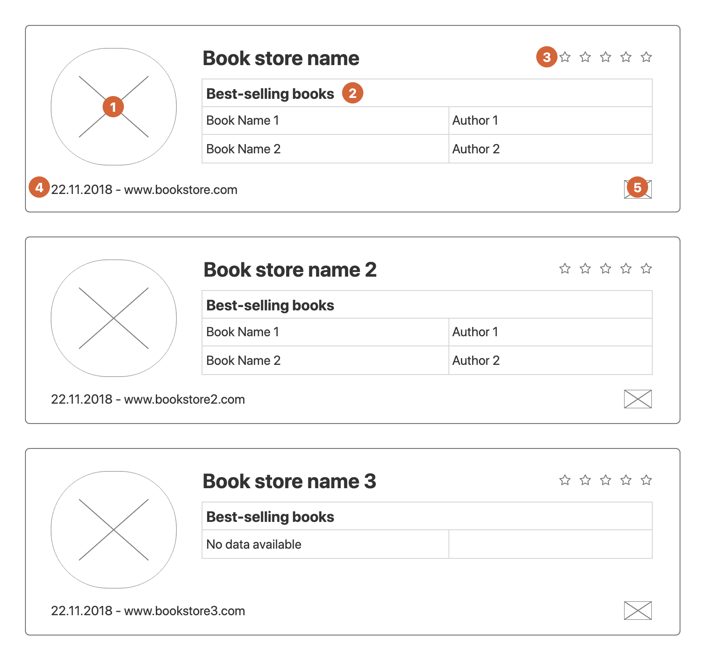

## Squirro Frontend Coding Challenge

Welcome to the Squirro coding challenge! Your task is to create an APP that lists the best-selling books for each book store.

This repo contains a JSON:API based application which provides the data for the book stores. This API can be found in the `book-store-api` folder. Within the section below you will find more information on how to run/use `book-store-api`.

Your goal is to present the data (that you receive from the API) as shown in the wireframe:

#### Each circle marker represents a specific task:

1. Circle with the Book store image.
2. List with a maximum of 2 books ordered by the number of copies sold. In case there are no books, please display a "No data available" message.
3. Book store rating represented in stars. The interaction with the rating should update its correspondent entry in the API.
4. Book store establishment date in DD.MM.YYYY format and website link. The API will return the date in ISO 8601 format.
5. Book store country flag image. The Book store API will only return a 2-letter ISO 3166-1 country code. Please use https://restcountries.eu/ API to get the flag image for each country code to display. In the event of unavailability of this API, please use any other equivalent API of your choice.

**You should follow the wireframe positioning of elements, but you can make it a bit prettier ;)**

### Book Store API

JSON:API is a specification on how a client should perform requests that fetch or modify resources, and how a server should respond to those requests.
You can find the JSON:API documentation on this link https://jsonapi.org/format/ but we will explain to you some of the basics here to make it easier for you.

The Book store API contains the `stores`, `books`, `countries`, and `authors` resources. Each of the resources can have an attributes object and a relationship object describing relationships between the resource and other resources.

**Breakdown of resources and their relationships:**

- Stores
  - Attributes:
    - `name`
    - `website`
    - `rating`
    - `image`
    - `establishmentDate`
  - Relationships
    - `books`
    - `countries`
- Books
  - Attributes:
    - `name`
    - `copiesSold`
  - Relationships
    - `authors`
- Countries
  - Attributes:
    - `code`
- Authors
  - Attributes:
    - `fullName`

The API endpoint that you will need for most of the tasks is: `http://localhost:3000/stores`. This endpoint will return all store resources and related resources within `included` array.
If you need any other endpoint, check the JSON:API specification.

If you have any issues with POST request returning errors - please read the first few sections of JSON:API documentation carefully.

#### Running API:

- Clone this repo locally
- `cd` inside `book-store-api` folder and run `npm install`
- Serve it on the port 3000 by running `npm run start`

#### Commiting:

- Please do not open pull requests against our repository!
- Instead, create your repository and send that over

#### Rules

- You can choose between Backbone and React as your main framework.
- Don't use JSON:API response normalizer libraries, do it yourself.
- The project startup procedure must be documented.
- Javascript should be written in ES6 or above (TypeScript is welcomed).
- GIT history must be clean.
- Application presentation must be done by responsive web design principles.
- Write CSS from scratch, please do not use Bootstrap, Material UI, and similar.

#### Happy coding and thank you for applying to Squirro!
